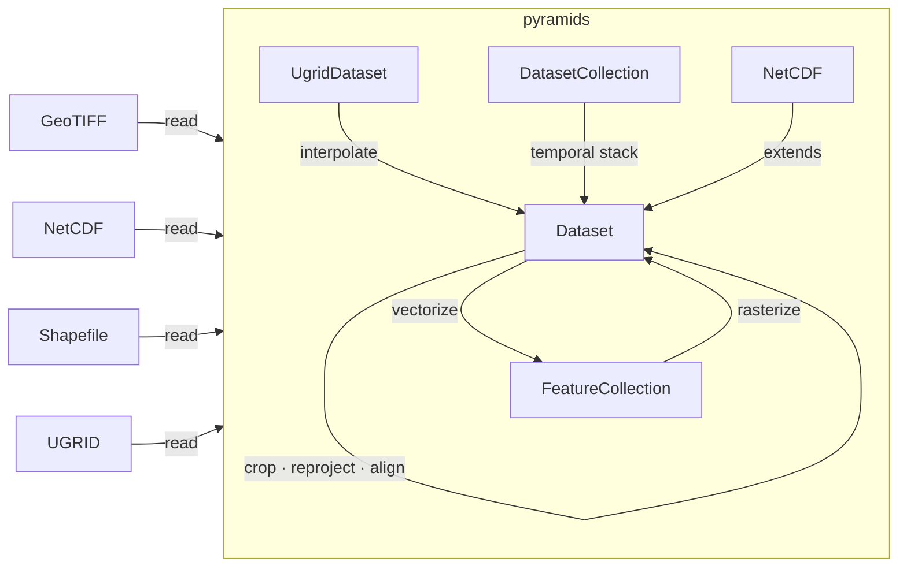

[](https://serapeum-org.github.io/pyramids/main/)
[](https://img.shields.io/pypi/pyversions/pyramids-gis)
[](https://www.gnu.org/licenses/gpl-3.0)
[](https://github.com/pre-commit/pre-commit)


[](https://codecov.io/gh/serapeum-org/pyramids)
[](https://www.codacy.com/gh/serapeum-org/pyramids/dashboard?utm_source=github.com&amp;utm_medium=referral&amp;utm_content=serapeum-org/pyramids&amp;utm_campaign=Badge_Grade)


[](https://github.com/serapeum-org/pyramids/actions/workflows/pages/pages-build-deployment)

Current release info
====================

| Name                                                                                                                 | Downloads                                                                                                                                                                                                                                                                                                                                                                                                                                                                                                                   | Version                                                                                                                                                                                                                     | Platforms                                                                                                                                                                                                |
|----------------------------------------------------------------------------------------------------------------------|-----------------------------------------------------------------------------------------------------------------------------------------------------------------------------------------------------------------------------------------------------------------------------------------------------------------------------------------------------------------------------------------------------------------------------------------------------------------------------------------------------------------------------|-----------------------------------------------------------------------------------------------------------------------------------------------------------------------------------------------------------------------------|----------------------------------------------------------------------------------------------------------------------------------------------------------------------------------------------------------|
| [](https://anaconda.org/conda-forge/pyramids) | [](https://anaconda.org/conda-forge/pyramids) [](https://pepy.tech/project/pyramids-gis) [](https://pepy.tech/project/pyramids-gis)  [](https://pepy.tech/project/pyramids-gis)   | [](https://anaconda.org/conda-forge/pyramids) [](https://badge.fury.io/py/pyramids-gis) | [](https://anaconda.org/conda-forge/pyramids) |

### conda-forge feedstock
[Conda-forge feedstock](https://github.com/conda-forge/pyramids-feedstock)


pyramids - GIS utility package
=====================================================================
**pyramids** is a GIS utility package built on top of GDAL/OGR for working with raster data (GeoTIFF, NetCDF),
vector data (shapefiles, GeoJSON), and multi-temporal datacubes.



For detailed architecture diagrams, see
[docs/overview/architecture.md](docs/overview/architecture.md).

Main Features
-------------

- **Dataset** - Read, write, crop, reproject, and align single-band and multi-band rasters (GeoTIFF)
  with full no-data handling and coordinate reference system support.
- **NetCDF** - Extends Dataset for NetCDF files with time/variable dimensions and CF conventions metadata.
  Optional xarray interoperability.
- **UgridDataset** - Read and visualize UGRID-1.0 unstructured meshes (triangles, quads, mixed).
  Supports mesh-to-raster interpolation and mesh-to-vector export.
- **DatasetCollection** - Manage time-series of co-registered rasters as a temporal stack for
  multi-temporal analysis.
- **FeatureCollection** - Work with vector data (shapefiles, GeoJSON) through a unified GeoDataFrame and
  OGR DataSource interface, including rasterization and geometry operations.
- **Spatial operations** - Align rasters to a reference grid, reproject between coordinate systems,
  crop to vector boundaries, and convert between raster, NetCDF, and vector formats.

Installing pyramids
===============

### pip (recommended)

pyramids-gis ships **self-contained platform wheels** on PyPI that
bundle GDAL, PROJ, GEOS, HDF4/5, NetCDF, and all native dependencies.
No system GDAL required.

```
pip install pyramids-gis
```

Supported platforms: Linux (glibc ≥ 2.39, i.e. Ubuntu 24.04+, RHEL 10+),
macOS 11+ (Intel + Apple Silicon), Windows 10+ (x64).

Optional extras:

```
pip install "pyramids-gis[viz]"      # cleopatra plotting support
pip install "pyramids-gis[xarray]"   # xarray / NetCDF4 interop
```

### conda-forge

```
conda install -c conda-forge pyramids
```

List available versions:

```
conda search pyramids --channel conda-forge
```

### Install from GitHub (development)

To install the latest development version from `main`:

```
pip install git+https://github.com/Serapieum-of-alex/pyramids
```

Note: installing from GitHub uses the sdist and requires a pre-installed
system GDAL. See the full [installation guide](docs/installation.md)
and [troubleshooting](docs/troubleshooting.md) for details.

Quick start
===========

```python
from pyramids.dataset import Dataset

# Open a raster file
src = Dataset.read_file("path/to/raster.tif")
print(src.epsg)        # coordinate reference system EPSG code
print(src.cell_size)   # pixel resolution
print(src.shape)       # (rows, columns)

# Get the raster data as a NumPy array
arr = src.raster.ReadAsArray()
```

```python
from pyramids.netcdf import NetCDF

# Open a NetCDF file
nc = NetCDF.read_file("path/to/data.nc")
print(nc.variables)
```

```python
from pyramids.feature import FeatureCollection

# Open a vector file
vector = FeatureCollection.read_file("path/to/shapefile.shp")
print(vector.shape)
```

Testing
=======

This project uses [pixi](https://pixi.sh) as the environment and task manager.

```console
# Install dependencies and create dev environment
pixi install -e dev

# Run all tests (excluding plot tests)
pixi run -e dev main

# Run plot tests only
pixi run -e dev plot

# Run a specific test file
pixi run -e dev pytest tests/netcdf/test_dimensions.py -v

# Run a single test by node id
pixi run -e dev pytest tests/netcdf/test_dimensions.py::TestStripBraces::test_with_braces -q
```

Docker
======

A Dockerfile is provided to run pyramids-gis in a controlled environment with the correct GDAL stack
preinstalled via conda-forge. The image uses a multi-stage pixi build for a minimal production container.

Build the image:

```
docker build -t pyramids-gis:latest .
```

Run the container (mount your current folder as /workspace):

```
docker run --rm -it -v ${PWD}:/workspace pyramids-gis:latest bash
```

Inside the container you can verify the package is installed:

```
python -c "import pyramids; print('pyramids', pyramids.__version__)"
```
