# Architecture Diagrams

Below are core diagrams describing the system at multiple levels.

## C4: System Context

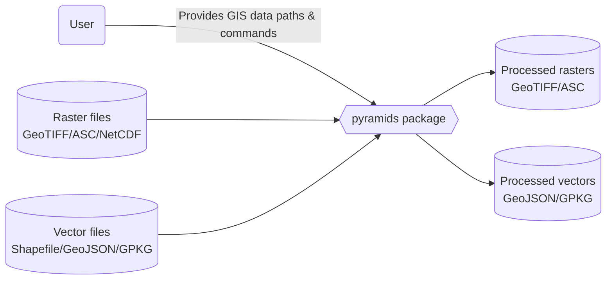

## C4: Containers

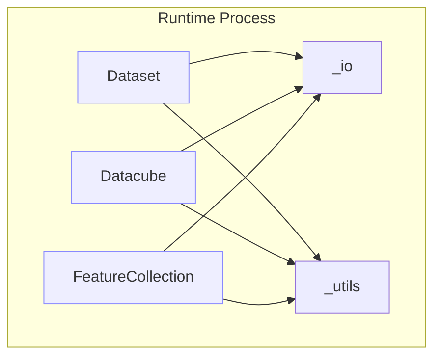

## C4: Components

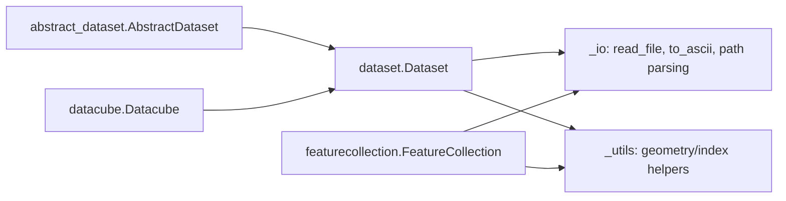

## UML Class: Raster Core

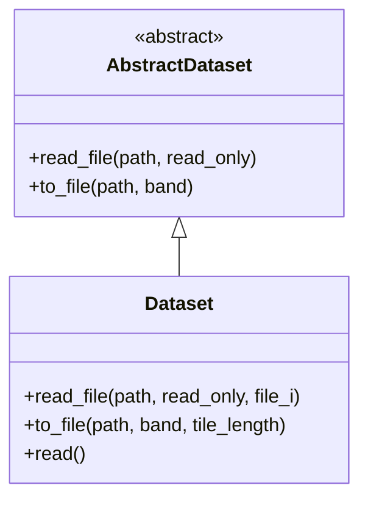

## UML Class: Vector Core

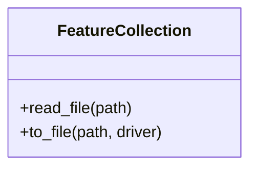

## Sequence: Read Raster from Zip

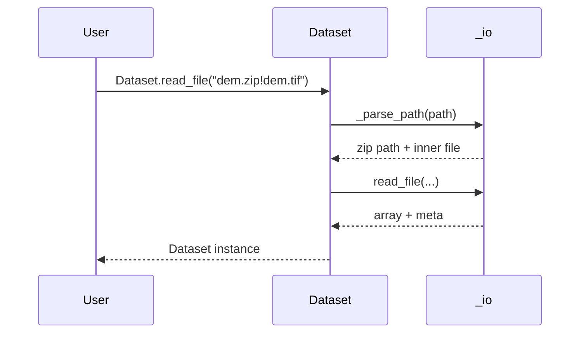

## Sequence: Save Raster to GeoTIFF

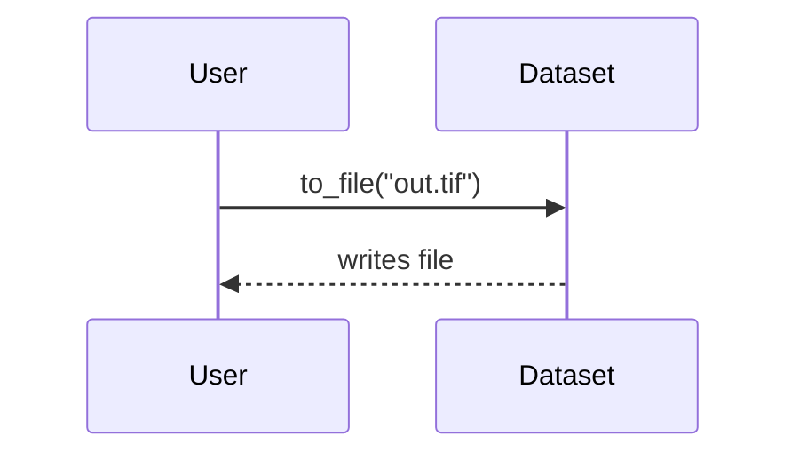

## Sequence: Build Datacube from Folder

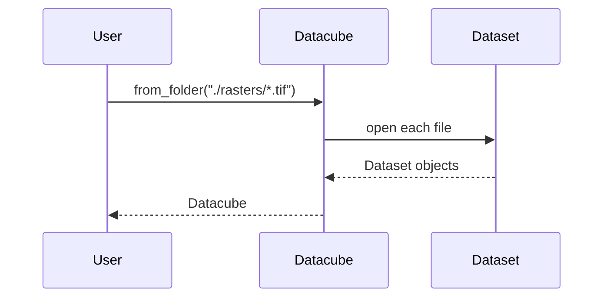

## Sequence: Zonal Statistics

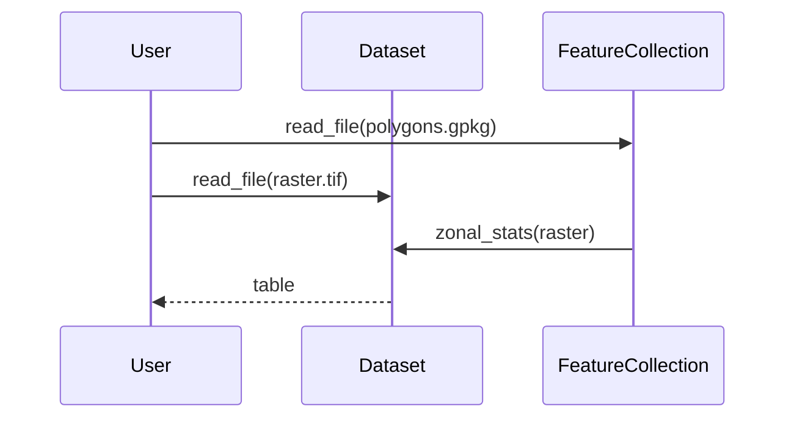

## Sequence: Align and Resample

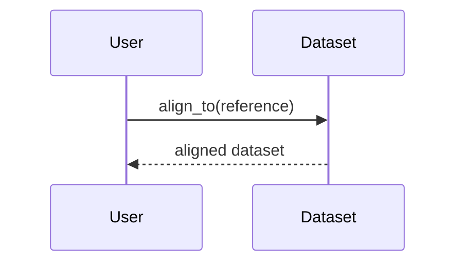

## Dependency Graph (Modules)

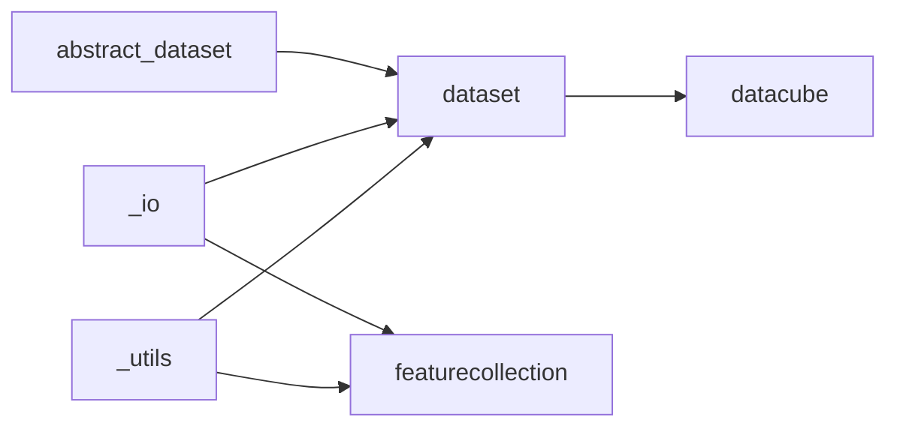
