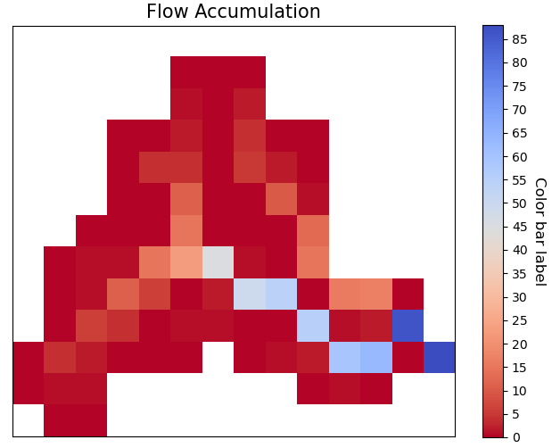
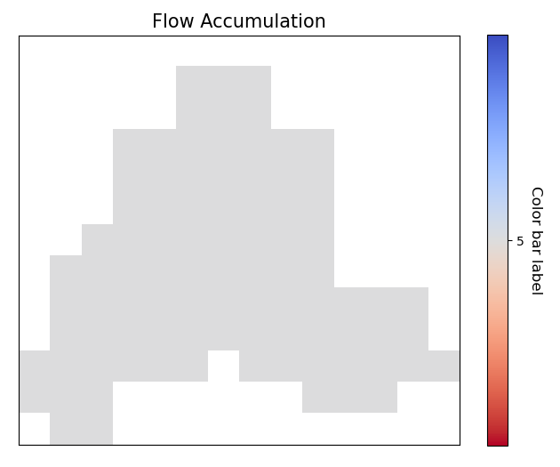
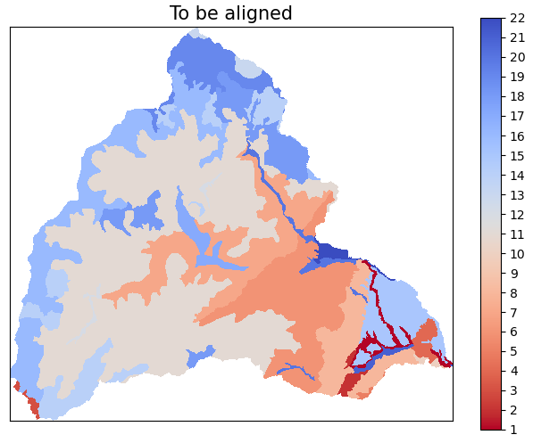

# dataset

- dataset module contains Two classes `Dataset` and `DataCube`.

.. digraph:: Linking

    dataset -> Dataset;
    dataset -> DataCube;
    dpi=200;

- Dataset represent a raster object which could be created from reading a geotiff, netcdf, ascii or any file
    format/driver supported by gdal.
- The raster could have single or multi bands.
- The raster could have different variables (like netcdf file) and these variable can have similar or different
    dimensions.

- DataCube represent a stack of raster's which have the same dimensions, contains data that have same dimensions (rows
    & columns).


## Dataset

- The main purpose of the `Dataset` object is to deal with raster objects, single or multi-bands, has variables/subsets
    like netcdf file or has one variable like most GeoTIFF files.
  


- The `Dataset` object data model is as following


- To import the Dataset object

```python

from pyramids.dataset import Dataset
```
to start exploring the functionality of the dataset module `read_file` method to read any raster file.

## read_file
- to read any files using the Dataset object you can use the `read_file` method.

```python

path = "examples/data/dem/DEM5km_Rhine_burned_fill.tif"
dataset = Dataset.read_file(path)
dataset.plot(title="Rhine river basin", ticks_spacing=500,cmap="terrain", color_scale=1, vmin=0,
         cbar_label="Elevation (m)")
```


- The `read_file` method detects the type of the input file from the extension at the end of the path.
- Similarly, you can read an ascii file using the same way.


- For ASCII files

```python

path = "examples/data/dem/dem5km_rhine.asc"
dataset = Dataset.read_file(path)
dataset.plot(title="Rhine river basin", ticks_spacing=500,cmap="terrain", color_scale=1, vmin=0,
            cbar_label="Elevation (m)")
```
- For netcdf file

```python

path = "examples/data/dem/dem5km_rhine.nc"
dataset = Dataset.read_file(path)
dataset.plot(title="Rhine river basin", ticks_spacing=500,cmap="terrain", color_scale=1, vmin=0,
            cbar_label="Elevation (m)")
```

## Dataset object attributes

- The Dataset object has  the following attributes, which enables you to access all the stored data in you raster
    file (GeoTIFF/NetCDF/ASCII)


### raster

```python

print(dataset.raster)
<osgeo.gdal.Dataset; proxy of <Swig Object of type 'GDALDatasetShadow *' at 0x0000026C8DD51FE0> >
```
### cell_size

```python

print(dataset.cell_size)
>>> 5000.0
```
### values

```python

print(dataset.values)
>>> array([[-3.4028235e+38, -3.4028235e+38, -3.4028235e+38, ...,
         -3.4028235e+38, -3.4028235e+38, -3.4028235e+38],
         [-3.4028235e+38, -3.4028235e+38, -3.4028235e+38, ...,
         -3.4028235e+38, -3.4028235e+38, -3.4028235e+38],
         [-3.4028235e+38, -3.4028235e+38, -3.4028235e+38, ...,
         -3.4028235e+38, -3.4028235e+38, -3.4028235e+38],
         ...,
         [-3.4028235e+38, -3.4028235e+38, -3.4028235e+38, ...,
         -3.4028235e+38, -3.4028235e+38, -3.4028235e+38],
         [-3.4028235e+38, -3.4028235e+38, -3.4028235e+38, ...,
         -3.4028235e+38, -3.4028235e+38, -3.4028235e+38],
         [-3.4028235e+38, -3.4028235e+38, -3.4028235e+38, ...,
         -3.4028235e+38, -3.4028235e+38, -3.4028235e+38]], dtype=float32)
```
### shape

```python
print(dataset.shape)
(1, 125, 93)

```
### rows

```python

print(dataset.rows)
>>> 125
```
### columns

```python

print(dataset.columns)
>>> 93
```
### pivot_point
- The upper left corner of the raster
    (minimum lon/x, maximum lat/y).

```python

print(dataset.pivot_point)
>>> (32239263.70388, 5756081.42235)
```
### geotransform
- geotransform data of the upper left corner of the raster
    (minimum lon/x, pixel-size, rotation, maximum lat/y, rotation, pixel-size).

```python

print(dataset.geotransform)
>>> (32239263.70388, 5000.0, 0.0, 5756081.42235, 0.0, -5000.0)
```
### bounds
```python

print(dataset.bounds)
>>> 0  POLYGON ((32239263.704 5756081.422, 32239263.7...
```

```python

dataset.bounds.plot()
```


### bbox
```python

print(dataset.bbox)
>>> [32239263.70388, 5131081.42235, 32704263.70388, 5756081.42235]
```
### epsg
- integer reference number that defines the projection (https://epsg.io/)

```python

print(dataset.epsg)
>>> 4647
```
### crs
```python

print(dataset.crs)
>>> 'PROJCS["ETRS89 / UTM zone 32N (zE-N)",GEOGCS["ETRS89",DATUM["European_Terrestrial_Reference_System_1989",SPHEROID["GRS 1980",6378137,298.257222101004,AUTHORITY["EPSG","7019"]],AUTHORITY["EPSG","6258"]],PRIMEM["Greenwich",0],UNIT["degree",0.0174532925199433,AUTHORITY["EPSG","9122"]],AUTHORITY["EPSG","4258"]],PROJECTION["Transverse_Mercator"],PARAMETER["latitude_of_origin",0],PARAMETER["central_meridian",9],PARAMETER["scale_factor",0.9996],PARAMETER["false_easting",32500000],PARAMETER["false_northing",0],UNIT["metre",1,AUTHORITY["EPSG","9001"]],AXIS["Easting",EAST],AXIS["Northing",NORTH],AUTHORITY["EPSG","4647"]]'
```

### lat/y
```python

dataset.lat or dataset.y
>>> array([5753581.42235, 5748581.42235, 5743581.42235, 5738581.42235,
        5733581.42235, 5728581.42235, 5723581.42235, 5718581.42235,
        5713581.42235, 5708581.42235, 5703581.42235, 5698581.42235,
        5693581.42235, 5688581.42235, 5683581.42235, 5678581.42235,
        5673581.42235, 5668581.42235, 5663581.42235, 5658581.42235,
        5653581.42235, 5648581.42235, 5643581.42235, 5638581.42235,
        5633581.42235, 5628581.42235, 5623581.42235, 5618581.42235,
        5613581.42235, 5608581.42235, 5603581.42235, 5598581.42235,
        5593581.42235, 5588581.42235, 5583581.42235, 5578581.42235,
        5573581.42235, 5568581.42235, 5563581.42235, 5558581.42235,
        5553581.42235, 5548581.42235, 5543581.42235, 5538581.42235,
        5533581.42235, 5528581.42235, 5523581.42235, 5518581.42235,
        5513581.42235, 5508581.42235, 5503581.42235, 5498581.42235,
        5493581.42235, 5488581.42235, 5483581.42235, 5478581.42235,
        5473581.42235, 5468581.42235, 5463581.42235, 5458581.42235,
        5453581.42235, 5448581.42235, 5443581.42235, 5438581.42235,
        5433581.42235, 5428581.42235, 5423581.42235, 5418581.42235,
        5413581.42235, 5408581.42235, 5403581.42235, 5398581.42235,
        5393581.42235, 5388581.42235, 5383581.42235, 5378581.42235,
        5373581.42235, 5368581.42235, 5363581.42235, 5358581.42235,
        5353581.42235, 5348581.42235, 5343581.42235, 5338581.42235,
        5333581.42235, 5328581.42235, 5323581.42235, 5318581.42235,
        5313581.42235, 5308581.42235, 5303581.42235, 5298581.42235,
        5293581.42235, 5288581.42235, 5283581.42235, 5278581.42235,
        5273581.42235, 5268581.42235, 5263581.42235, 5258581.42235,
        5253581.42235, 5248581.42235, 5243581.42235, 5238581.42235,
        5233581.42235, 5228581.42235, 5223581.42235, 5218581.42235,
        5213581.42235, 5208581.42235, 5203581.42235, 5198581.42235,
        5193581.42235, 5188581.42235, 5183581.42235, 5178581.42235,
        5173581.42235, 5168581.42235, 5163581.42235, 5158581.42235,
        5153581.42235, 5148581.42235, 5143581.42235, 5138581.42235,
        5133581.42235])
```
### lon/x
```python

dataset.lon/dataset.x
array([32241763.70388, 32246763.70388, 32251763.70388, 32256763.70388,
    32261763.70388, 32266763.70388, 32271763.70388, 32276763.70388,
    32281763.70388, 32286763.70388, 32291763.70388, 32296763.70388,
    32301763.70388, 32306763.70388, 32311763.70388, 32316763.70388,
    32321763.70388, 32326763.70388, 32331763.70388, 32336763.70388,
    32341763.70388, 32346763.70388, 32351763.70388, 32356763.70388,
    32361763.70388, 32366763.70388, 32371763.70388, 32376763.70388,
    32381763.70388, 32386763.70388, 32391763.70388, 32396763.70388,
    32401763.70388, 32406763.70388, 32411763.70388, 32416763.70388,
    32421763.70388, 32426763.70388, 32431763.70388, 32436763.70388,
    32441763.70388, 32446763.70388, 32451763.70388, 32456763.70388,
    32461763.70388, 32466763.70388, 32471763.70388, 32476763.70388,
    32481763.70388, 32486763.70388, 32491763.70388, 32496763.70388,
    32501763.70388, 32506763.70388, 32511763.70388, 32516763.70388,
    32521763.70388, 32526763.70388, 32531763.70388, 32536763.70388,
    32541763.70388, 32546763.70388, 32551763.70388, 32556763.70388,
    32561763.70388, 32566763.70388, 32571763.70388, 32576763.70388,
    32581763.70388, 32586763.70388, 32591763.70388, 32596763.70388,
    32601763.70388, 32606763.70388, 32611763.70388, 32616763.70388,
    32621763.70388, 32626763.70388, 32631763.70388, 32636763.70388,
    32641763.70388, 32646763.70388, 32651763.70388, 32656763.70388,
    32661763.70388, 32666763.70388, 32671763.70388, 32676763.70388,
    32681763.70388, 32686763.70388, 32691763.70388, 32696763.70388,
    32701763.70388])
```
### band_count
```python
print(dataset.band_count)
1
```
### band_names
```python
print(dataset.band_names)
['Band_1']

```
### variables
```python
print(dataset.variables)
{}

```
### no_data_value
```python
print(dataset.no_data_value)
[-3.4028234663852886e+38]

```
### meta_data
```python
print(dataset.meta_data)
{'Band1#grid_mapping': 'transverse_mercator', 'Band1#long_name': 'GDAL Band Number 1', 'Band1#_FillValue': '-3.4028235e+38', 'NC_GLOBAL#Conventions': 'CF-1.5', 'NC_GLOBAL#GDAL': 'GDAL 3.6.3, released 2023/03/07', 'NC_GLOBAL#GDAL_AREA_OR_POINT': 'Area', 'NC_GLOBAL#history': 'Sun Apr 16 22:17:20 2023: GDAL CreateCopy( examples/data/dem/dem5km_rhine.nc, ... )', 'transverse_mercator#crs_wkt': 'PROJCS["ETRS89 / UTM zone 32N (zE-N)",GEOGCS["ETRS89",DATUM["European_Terrestrial_Reference_System_1989",SPHEROID["GRS 1980",6378137,298.257222101004,AUTHORITY["EPSG","7019"]],AUTHORITY["EPSG","6258"]],PRIMEM["Greenwich",0],UNIT["degree",0.0174532925199433,AUTHORITY["EPSG","9122"]],AUTHORITY["EPSG","4258"]],PROJECTION["Transverse_Mercator"],PARAMETER["latitude_of_origin",0],PARAMETER["central_meridian",9],PARAMETER["scale_factor",0.9996],PARAMETER["false_easting",32500000],PARAMETER["false_northing",0],UNIT["metre",1,AUTHORITY["EPSG","9001"]],AXIS["Easting",EAST],AXIS["Northing",NORTH],AUTHORITY["EPSG","4647"]]', 'transverse_mercator#false_easting': '32500000', 'transverse_mercator#false_northing': '0', 'transverse_mercator#GeoTransform': '32239263.70388 5000 0 5756081.42235 0 -5000 ', 'transverse_mercator#grid_mapping_name': 'transverse_mercator', 'transverse_mercator#inverse_flattening': '298.257222101004', 'transverse_mercator#latitude_of_projection_origin': '0', 'transverse_mercator#longitude_of_central_meridian': '9', 'transverse_mercator#longitude_of_prime_meridian': '0', 'transverse_mercator#long_name': 'CRS definition', 'transverse_mercator#scale_factor_at_central_meridian': '0.9996', 'transverse_mercator#semi_major_axis': '6378137', 'transverse_mercator#spatial_ref': 'PROJCS["ETRS89 / UTM zone 32N (zE-N)",GEOGCS["ETRS89",DATUM["European_Terrestrial_Reference_System_1989",SPHEROID["GRS 1980",6378137,298.257222101004,AUTHORITY["EPSG","7019"]],AUTHORITY["EPSG","6258"]],PRIMEM["Greenwich",0],UNIT["degree",0.0174532925199433,AUTHORITY["EPSG","9122"]],AUTHORITY["EPSG","4258"]],PROJECTION["Transverse_Mercator"],PARAMETER["latitude_of_origin",0],PARAMETER["central_meridian",9],PARAMETER["scale_factor",0.9996],PARAMETER["false_easting",32500000],PARAMETER["false_northing",0],UNIT["metre",1,AUTHORITY["EPSG","9001"]],AXIS["Easting",EAST],AXIS["Northing",NORTH],AUTHORITY["EPSG","4647"]]', 'x#long_name': 'x coordinate of projection', 'x#standard_name': 'projection_x_coordinate', 'x#units': 'm', 'y#long_name': 'y coordinate of projection', 'y#standard_name': 'projection_y_coordinate', 'y#units': 'm'}

```
### dtype
```python
print(dataset.dtype)
[6]

```
### file_name
```python
print(dataset.file_name)
'examples/data/dem/dem5km_rhine.nc'

```
### time_stamp
```python
print(dataset.time_stamp)

```
### driver_type
```python
print(dataset.driver_type)
'geotiff'

```
### color_table
```python
print(dataset.color_table)
band values  red green blue alpha
 0    1      0    0     0    0     0
 1    1      1  112   153   89   255
 2    1      2    0     0    0     0
 3    1      3  242   238  162   255
 4    1      4    0     0    0     0
 5    1      5  242   206  133   255
 6    1      6    0     0    0     0
 7    1      7  194   140  124   255
 8    1      8    0     0    0     0
 9    1      9  214   193  156   255
```

## Create Dataset object


### create_from_array

- `create_from_array` method creates a `Dataset` from a given array and geotransform data
    and save the tif file if a Path is given or it will return the gdal.Dataset

#### Parameters
    path : [str], optional
        Path to save the Raster, if '' is given a memory raster will be returned. The default is ''.
    arr : [array], optional
        numpy array. The default is ''.
    geo : [list], optional
        geotransform list [minimum lon, pixel-size, rotation, maximum lat, rotation,
            pixel-size]. The default is ''.
    nodatavalue : TYPE, optional
        DESCRIPTION. The default is -9999.
    epsg: [integer]
        integer reference number to the new projection (https://epsg.io/)
            (default 3857 the reference no of WGS84 web mercator )

#### Returns
    dst : [gdal.Dataset/save raster to drive].
        if a path is given the created raster will be saved to drive, if not
        a gdal.Dataset will be returned.

- If we take the array we obtained from the `read_array`, do some arithmetic operation in it, then we created a
    `gdal.DataSet` out of it

```python
src = Raster.createRaster(arr=arr, geo=geo, epsg=str(epsg), nodatavalue=no_data_val)
Map.plot(src, title="Flow Accumulation")

```



### dataset_like
- `dataset_like` method creates a Geotiff raster like another input raster, new raster will have the same projection,
    coordinates or the top left corner of the original raster, cell size, nodata value, and number of rows and columns
    the raster and the dem should have the same number of columns and rows

#### Parameters
    src : [gdal.dataset]
        source raster to get the spatial information
    array : [numpy array]
        to store in the new raster
    path : [String]
        path to save the new raster including new raster name and extension (.tif)
    pixel_type : [integer]
        type of the data to be stored in the pixels,default is 1 (float32)
        for example pixel type of flow direction raster is unsigned integer
        1 for float32
        2 for float64
        3 for Unsigned integer 16
        4 for Unsigned integer 32
        5 for integer 16
        6 for integer 32

#### Returns
    save the new raster to the given path

- If we have made some calculation on raster array and we want to save the array back in the raster

```python
arr2 = np.ones(shape=arr.shape, dtype=np.float64) * nodataval
arr2[~np.isclose(arr, nodataval, rtol=0.001)] = 5

path = "examples/data/rasterlike.tif"
Raster.rasterLike(src, arr2, path)
```
- Now to check the raster that has been saved we can read it again with `gda.Open`

```python

dst = gdal.Open(path)
Map.plot(dst, title="Flow Accumulation", color_scale=1)
```




## Access data methods


### read_array
```python
arr = Dataset.read_array(src)
print(arr)
array([[-3.402823e+38, -3.402823e+38, -3.402823e+38, -3.402823e+38,
    -3.402823e+38, -3.402823e+38, -3.402823e+38, -3.402823e+38,
    -3.402823e+38, -3.402823e+38, -3.402823e+38, -3.402823e+38,
    -3.402823e+38, -3.402823e+38],
   [-3.402823e+38, -3.402823e+38, -3.402823e+38, -3.402823e+38,
    -3.402823e+38,  0.000000e+00,  0.000000e+00,  0.000000e+00,
    -3.402823e+38, -3.402823e+38, -3.402823e+38, -3.402823e+38,
    -3.402823e+38, -3.402823e+38],
   [-3.402823e+38, -3.402823e+38, -3.402823e+38, -3.402823e+38,
    -3.402823e+38,  1.000000e+00,  0.000000e+00,  2.000000e+00,
    -3.402823e+38, -3.402823e+38, -3.402823e+38, -3.402823e+38,
    -3.402823e+38, -3.402823e+38],
   [-3.402823e+38, -3.402823e+38, -3.402823e+38,  0.000000e+00,
     0.000000e+00,  2.000000e+00,  0.000000e+00,  4.000000e+00,
     0.000000e+00,  0.000000e+00, -3.402823e+38, -3.402823e+38,
    -3.402823e+38, -3.402823e+38],
   [-3.402823e+38, -3.402823e+38, -3.402823e+38,  0.000000e+00,
     4.000000e+00,  4.000000e+00,  0.000000e+00,  5.000000e+00,
     2.000000e+00,  0.000000e+00, -3.402823e+38, -3.402823e+38,
    -3.402823e+38, -3.402823e+38],
   [-3.402823e+38, -3.402823e+38, -3.402823e+38,  0.000000e+00,
     0.000000e+00,  1.100000e+01,  0.000000e+00,  0.000000e+00,
     1.000000e+01,  1.000000e+00, -3.402823e+38, -3.402823e+38,
    -3.402823e+38, -3.402823e+38],
   [-3.402823e+38, -3.402823e+38,  0.000000e+00,  0.000000e+00,
     0.000000e+00,  1.500000e+01,  0.000000e+00,  0.000000e+00,
     0.000000e+00,  1.300000e+01, -3.402823e+38, -3.402823e+38,
    -3.402823e+38, -3.402823e+38],
   [-3.402823e+38,  0.000000e+00,  1.000000e+00,  1.000000e+00,
     1.500000e+01,  2.300000e+01,  4.500000e+01,  1.000000e+00,
     0.000000e+00,  1.500000e+01, -3.402823e+38, -3.402823e+38,
    -3.402823e+38, -3.402823e+38],
   [-3.402823e+38,  0.000000e+00,  1.000000e+00,  1.100000e+01,
     6.000000e+00,  0.000000e+00,  2.000000e+00,  4.900000e+01,
     5.400000e+01,  0.000000e+00,  1.600000e+01,  1.700000e+01,
     0.000000e+00, -3.402823e+38],
   [-3.402823e+38,  0.000000e+00,  6.000000e+00,  4.000000e+00,
     0.000000e+00,  1.000000e+00,  1.000000e+00,  0.000000e+00,
     0.000000e+00,  5.500000e+01,  1.000000e+00,  2.000000e+00,
     8.600000e+01, -3.402823e+38],
   [ 0.000000e+00,  4.000000e+00,  2.000000e+00,  0.000000e+00,
     0.000000e+00,  0.000000e+00, -3.402823e+38,  0.000000e+00,
     1.000000e+00,  2.000000e+00,  5.900000e+01,  6.300000e+01,
     0.000000e+00,  8.800000e+01],
   [ 0.000000e+00,  1.000000e+00,  1.000000e+00, -3.402823e+38,
    -3.402823e+38, -3.402823e+38, -3.402823e+38, -3.402823e+38,
    -3.402823e+38,  0.000000e+00,  1.000000e+00,  0.000000e+00,
    -3.402823e+38, -3.402823e+38],
   [-3.402823e+38,  0.000000e+00,  0.000000e+00, -3.402823e+38,
    -3.402823e+38, -3.402823e+38, -3.402823e+38, -3.402823e+38,
    -3.402823e+38, -3.402823e+38, -3.402823e+38, -3.402823e+38,
    -3.402823e+38, -3.402823e+38]], dtype=float32)

```

#### Blocksize and ReadAsArray
- The `read_array` method reads the raster as a numpy array, the method can take a block size to read the raster
    in blocks, this is useful when the raster is too large to be read at once.

When you know the block size, you can more effectively plan and execute data processing tasks:
- Data Reading/Writing: When reading or writing data, doing so in multiples of the block size can reduce the number of
disk accesses required, as each access operation will align with the blocks on disk.
- Optimizations: Some formats are optimized for specific block sizes, or for being accessed in certain ways. For
example, tiled TIFFs might perform better with square block sizes.

```python

dataset = Dataset.read_file("tests/data/geotiff/era5_land_monthly_averaged.tif")
arr = dataset.read_array(window=[0, 0, 5, 5])
print(arr.shape)
(5, 5)
```
- to get the block size of the dataset

```python

print(dataset.blocksize)
(128, 128)
```
### Band statistics (stats)
- To get a summary statistics (min, max, mean, std) of a band/all bands.
- The method returns a `DataFrame` of statistics values of each band, the dataframe has the following columns:
    [min, max, mean, std], the index of the dataframe is the band names.

```python

era5_image = "tests/data/geotiff/era5_land_monthly_averaged.tif"
dataset = Dataset.read_file(era5_image)
stats = dataset.stats()
print(stats)
             min         max        mean       std
  Band_1  270.369720  270.762299  270.551361  0.154270
  Band_2  269.611938  269.744751  269.673645  0.043788
  Band_3  273.641479  274.168823  273.953979  0.198447
  Band_4  273.991516  274.540344  274.310669  0.205754
```
- The method can also take a mask (polygon/dataset) to calculate the statistics of the masked area only.

```python

era5_image = "tests/data/geotiff/era5_land_monthly_averaged.tif"
dataset = Dataset.read_file(era5_image)
mask = gpd.read_file("tests/data/geotiff/era5-mask.geojson")
stats = dataset.stats(mask=mask)
print(stats)
             min         max        mean       std
  Band_1  270.369720  270.399017  270.384369  0.014648
  Band_2  269.651001  269.744751  269.697876  0.046875
  Band_3  273.889526  273.901245  273.895386  0.005859
  Band_4  274.235657  274.255188  274.245422  0.009766
```
## Write raster to disk

to write the dataset object to disk using any of the raster formats (GeoTIFF/NetCDF/ASCII), you can use the `to_file`
method.


### to_file

- `to_file` writes the Dataset object to disk.

#### Parameters
    path: [str]
        a path including the name of the raster and extension.
        >>> path = "data/cropped.tif"
    driver: [str]
            driver = "geotiff"/"ascii"/"netcdf".
    band: [int]
        band index, needed only in case of ascii drivers. Default is 0.

#### GeoTIFF
```python

dataset.to_file("examples/data/dem/dem5km_rhine.tif", driver="geotiff")
```
#### ASCII
```python

dataset.to_file("examples/data/dem/dem5km_rhine.asc", driver="ascii")
```
- The ASCII file will look like

```python

ncols         93
nrows         125
xllcorner     32239263.70388
yllcorner     5131081.42235
cellsize      5000.0
NODATA_value  -3.4028230607370965e+38
0.03  0.03  0.03  0.03  0.03  0.03  0.03  0.03  0.03  0.03  0.03  0.03  0.03  0.03
0.03  0.03  0.03  0.03  0.03  0.03  0.03  0.03  0.03  0.03  0.03  0.03  0.03  0.03
0.03  0.03  0.03  0.03  0.03  0.03  0.03  0.03  0.03  0.03  0.03  0.03  0.03  0.03
0.03  0.03  0.03  0.03  0.03  0.03  0.03  0.03  0.03  0.03  0.03  0.03  0.03  0.03
0.03  0.03  0.03  0.03  0.03  0.03  0.03  0.03  0.03  0.03  0.03  0.03  0.03  0.03
0.03  0.03  0.03  0.03  0.03  0.03  0.03  0.03  0.03  0.03  0.03  0.03  0.03  0.03
0.03  0.03  0.03  0.03  0.03  0.03  0.03  0.03  0.03  0.03  0.03  0.03  0.03  0.03
0.03  0.03  0.03  0.03  0.03  0.03  0.03  0.03  0.03  0.03  0.03  0.03  0.03  0.03
0.03  0.03  0.03  0.03  0.03  0.03  0.03  0.03  0.03  0.03  0.03  0.03  0.03  0.03
0.03  0.03  0.03  0.03  0.03  0.03  0.03  0.03  0.03  0.03  0.03  0.03  0.03  0.03
0.03  0.03  0.03  0.03  0.03  0.03  0.03  0.03  0.03  0.03  0.03  0.03  0.03  0.03
0.03  0.03  0.03  0.03  0.03  0.03  0.03  0.03  0.03  0.03  0.03  0.03  0.03  0.03
0.03  0.03  0.03  0.03  0.03  0.03  0.03  0.03  0.03  0.03  0.03  0.03  0.03  0.03
```
#### NetCDF
```python

dataset.to_file("examples/data/dem/dem5km_rhine.nc", driver="netcdf")
```

## Spatial properties


### convert_longitude
- some files (especially netcdf files) uses longitude values from 0 degrees to 360 degrees, instead of the usual,
    GIS-standard, arrangement of -180 degrees to 180 degrees for longitude centered on the Prime Meridian, and -90 degrees
    to 90 degrees for latitude centered on the Equator. the `convert_longitude` method corrects such behavior.


- read the raster files using the `read_file` and plot it with the `plot` method.

```python

dataset = Dataset.read_file(path)
fig, ax = dataset.plot(
    band=0, figsize=(10, 5), title="Noah daily Precipitation 1979-01-01", cbar_label="Raindall mm/day", vmax=30,
    cbar_length=0.85
)
```
- You cas see how the most left of the map lies the african continent instead of north and south america.


- To correct the values of the longitude you can use the `convert_longitude` as follows.


```python

new_dataset = dataset.convert_longitude()
new_dataset.plot(
    band=0, figsize=(10, 5), title="Noah daily Precipitation 1979-01-01", cbar_label="Raindall mm/day", vmax=30,
    cbar_length=0.85
)
```


### resample

- `resample` reproject a raster to any projection (default the WGS84 web mercator projection, without
    resampling) The function returns a GDAL in-memory file object, where you can ReadAsArray etc.

#### Parameters
    src : [gdal.Dataset]
         gdal raster (src=gdal.Open("dem.tif"))
    cell_size : [integer]
         new cell size to resample the raster. (default empty so raster will not be resampled)
    resample_technique : [String]
        resampling technique default is "Nearest"
        https://gisgeography.com/raster-resampling/
        "Nearest" for nearest neighbour,"cubic" for cubic convolution,
        "bilinear" for bilinear

#### Returns
    raster : [gdal.Dataset]
         gdal object (you can read it by ReadAsArray)


```python

print("Original Cell Size =" + str(geo[1]))
cell_size = 100
dst = Raster.resampleRaster(src, cell_size, resample_technique="bilinear")

dst_arr = Raster.read_array(dst)
_, new_geo = Raster.getProjectionData(dst)
print("New cell size is " + str(new_geo[1]))
Map.plot(dst, title="Flow Accumulation")

Original Cell Size =4000.0
New cell size is 100.0
```


### to_crs

- `to_crs` re-projects a raster to any projection (default the WGS84 web mercator projection, without resampling)
    The function returns a GDAL in-memory file object, where you can ReadAsArray etc.

#### Parameters
    to_epsg: [integer]
        reference number to the new projection (https://epsg.io/)
        (default 3857 the reference no of WGS84 web mercator )
    method: [String]
        resampling technique default is "Nearest"
        https://gisgeography.com/raster-resampling/
        "nearest neighbour" for nearest neighbour,"cubic" for cubic convolution,
        "bilinear" for bilinear
    maintain_alignment : [bool]
        True to maintain the number of rows and columns of the raster the same after re-projection. Default is False.

#### Returns
    raster:
        gdal dataset (you can read it by ReadAsArray)

```python

print("current EPSG - " + str(epsg))
to_epsg = 4326
dst = Raster.projectRaster(src, to_epsg=to_epsg, option=1)
new_epsg, new_geo = Raster.getProjectionData(dst)
print("New EPSG - " + str(new_epsg))
print("New Geotransform - " + str(new_geo))

current EPSG - 32618
New EPSG - 4326
New Geotransform - (-75.60441, 0.03606600000000526, 0.0, 4.704305, 0.0, -0.03606600000000526)
```

- Option 2

```python

dst = Raster.projectRaster(src, to_epsg=to_epsg, option=2)
new_epsg, new_geo = Raster.getProjectionData(dst)
print("New EPSG - " + str(new_epsg))
print("New Geotransform - " + str(new_geo))

New EPSG - 4326
New Geotransform - (-75.60441003848668, 0.03611587177268461, 0.0, 4.704560448076901, 0.0, -0.03611587177268461)
```

### crop
- If you have an array and you want to clip/crop it using another raster/array.

#### Crop array using a raster
- The `crop` method clips/crops (matches the location of nodata value from source raster to destination raster).

Parameters
""""""""""
    src: [gdal.dataset/np.ndarray]
        raster you want to clip/store NoDataValue in its cells
        exactly the same like mask raster
    mask: [gdal.dataset/np.ndarray]
        mask raster to get the location of the NoDataValue and
        where it is in the array
    mask_noval: [numeric]
        in case the mask is np.ndarray, the mask_noval have to be given.

Returns
"""""""
    dst: [gdal.dataset]
        the second raster with NoDataValue stored in its cells exactly the same like src raster


```python

aligned_raster = "examples/data/Evaporation_ECMWF_ERA-Interim_mm_daily_2009.01.01.tif"
band = 1
dst = Dataset.Open(aligned_raster)
dst_arr = dst.read_array()
dst_nodataval = dst.no_data_value[band - 1]

Map.plot(
    dst_arr,
    nodataval=dst_nodataval,
    title="Before Cropping-Evapotranspiration",
    color_scale=1,
    ticks_spacing=0.01,
)
```


```python

dst_arr_cropped = Raster.cropAlligned(dst_arr, src)
Map.plot(
    dst_arr_cropped,
    nodataval=nodataval,
    title="Cropped array",
    color_scale=1,
    ticks_spacing=0.01,
)
```


#### Crop raster using another raster while preserving the alignment
- cropping rasters may  change the alignment of the cells and to keep the alignment during cropping a raster we will
    crop the same previous raster but will give the input to the function as a gdal.dataset object.


```python

dst_cropped = Raster.cropAlligned(dst, src)
Map.plot(dst_cropped, title="Cropped raster", color_scale=1, ticks_spacing=0.01)
```


#### Crop raster using array

```python

dst_cropped = Raster.cropAlligned(dst, arr, mask_noval=nodataval)
Map.plot(dst_cropped, title="Cropped array", color_scale=1, ticks_spacing=0.01)
```


#### crop
- `crop` method crops a raster using another raster/polygon.

Parameters
""""""""""
    mask: [Polygon GeoDataFrame/Dataset]
            GeodataFrame with a polygon geometry, or a Dataset object.
    touch: [bool]
        To include the cells that touch the polygon not only those that lie entirely inside the polygon mask.
        Default is True.
    inplace: [bool]
        True to make the changes in place.

Returns
"""""""
    Dataset:
        Dataset object.


```python

RasterA = gdal.Open(aligned_raster)
epsg, geotransform = Raster.getProjectionData(RasterA)
print("Raster EPSG = " + str(epsg))
print("Raster Geotransform = " + str(geotransform))
Map.plot(RasterA, title="Raster to be cropped", color_scale=1, ticks_spacing=1)

Raster EPSG = 32618
Raster Geotransform = (432968.1206170588, 4000.0, 0.0, 520007.787999178, 0.0, -4000.0)
```


- We will use the soil raster from the previous example as a mask so the projection is different between the raster
    and the mask and the cell size is also different

```python

dst = Raster.crop(RasterA, soil_raster)
dst_epsg, dst_geotransform = Raster.getProjectionData(dst)
print("resulted EPSG = " + str(dst_epsg))
print("resulted Geotransform = " + str(dst_geotransform))
Map.plot(dst, title="Cropped Raster", color_scale=1, ticks_spacing=1)

resulted EPSG = 32618
resulted Geotransform = (432968.1206170588, 4000.0, 0.0, 520007.787999178, 0.0, -4000.0)
```


### align
- `matchRasterAlignment` method matches the coordinate system and the number of of rows & columns between two rasters
    alignment_src is the source of the coordinate system, number of rows, number of columns & cell size data_src is the
    source of data values in cells the result will be a raster with the same structure like alignment_src but with values
    from data_src using Nearest Neighbour interpolation algorithm

#### Parameters
    alignment_src : [gdal.dataset/string]
        spatial information source raster to get the spatial information
        (coordinate system, no of rows & columns)
    data_src : [gdal.dataset/string]
        data values source raster to get the data (values of each cell)

#### Returns
    dst : [gdal.dataset]
        result raster in memory

```python

soil_raster = gdal.Open(soilmappath)
epsg, geotransform = Raster.getProjectionData(soil_raster)
print("Before alignment EPSG = " + str(epsg))
print("Before alignment Geotransform = " + str(geotransform))
# cell_size = geotransform[1]
Map.plot(soil_raster, title="To be aligned", color_scale=1, ticks_spacing=1)

Before alignment EPSG = 3116
Before alignment Geotransform = (830606.744300001, 30.0, 0.0, 1011325.7178760837, 0.0, -30.0)
```



```python

soil_aligned = Raster.matchRasterAlignment(src, soil_raster)
New_epsg, New_geotransform = Raster.getProjectionData(soil_aligned)
print("After alignment EPSG = " + str(New_epsg))
print("After alignment Geotransform = " + str(New_geotransform))
Map.plot(soil_aligned, title="After alignment", color_scale=1, ticks_spacing=1)

After alignment EPSG = 32618
After alignment Geotransform = (432968.1206170588, 4000.0, 0.0, 520007.787999178, 0.0, -4000.0)
```


### get_cell_coords

- `getCellCoords` returns the coordinates of all cell centres inside the domain (only the cells that
        does not have nodatavalue)

#### Parameters
    src : [gdal_Dataset]
        Get the data from the gdal datasetof the DEM

#### Returns
    coords : array
        Array with a list of the coordinates to be interpolated, without the Nan
    mat_range : array
        Array with all the centres of cells in the domain of the DEM


```python

coords, centers_coords = Raster.getCellCoords(src)
print(coords)
array([[434968.12061706, 520007.78799918],
   [434968.12061706, 520007.78799918],
   [434968.12061706, 520007.78799918],
   [434968.12061706, 520007.78799918],
   [434968.12061706, 520007.78799918],
   [434968.12061706, 520007.78799918],
   [434968.12061706, 520007.78799918],

print(centers_coords)
array([[[434968.12061706, 520007.78799918],
    [438968.12061706, 520007.78799918],
    [442968.12061706, 520007.78799918],
    [446968.12061706, 520007.78799918],
    [450968.12061706, 520007.78799918],
    [454968.12061706, 520007.78799918],
    [458968.12061706, 520007.78799918],
```


```python

path = "examples/data/save_raster_test.tif"
Raster.saveRaster(src, path)
```
### overlay

The `overlay` function takes two ascii files the `BaseMap` which is the
raster/asc file of the polygons and the secon is the asc file you want to
extract its values.


```python

def overlayMap(
        path: str,
        classes_map: Union[str, np.ndarray],
        exclude_value: Union[float, int],
        compressed: bool=False,
        occupied_cells_only: bool=True) -> Tuple[Dict[List[float], List[float]], int]:
"""
"""overlayMap.

        OverlayMap extracts and return a list of all the values in an ASCII file,
        if you have two maps one with classes, and the other map contains any type of values,
        and you want to know the values in each class
```
#### Parameters
path: [str]
    a path to ascii file.
classes_map: [str/array]
    a path including the name of the ASCII and extension, or an array
    >>> path = "classes.asc"
exclude_value: [Numeric]
    values you want to exclude from extracted values.
compressed: [Bool]
    if the map you provided is compressed.
occupied_cells_only: [Bool]
    if you want to count only cells that is not zero.

#### Returns
ExtractedValues: [Dict]
    dictionary with a list of values in the basemap as keys
        and for each key a list of all the intersected values in the
        maps from the path.
NonZeroCells: [dataframe]
    the number of cells in the map.


To extract the

```python

import Hapi.raster as R

Path = "F:/02Case studies/Hapi Examples/"
SavePath  = Path + "results/ZonalStatistics"
BaseMapF = Path + "data/Polygons.tif"
ExcludedValue = 0
Compressed = True
OccupiedCellsOnly = False

ExtractedValues, Cells = R.OverlayMap(Path+"DepthMax22489.zip", BaseMapF,ExcludedValue, Compressed,OccupiedCellsOnly)
```
### count_domain_cells
- To number of cells in a raster that are not `no_data_value` value.

#### Parameters
band: [int]
    band index. Default is 0.

#### Returns
int:
    Number of cells

```python

    path = "examples/data/dem/DEM5km_Rhine_burned_fill.tif"
    dataset = Dataset.read_file(path)
    cells = dataset.count_domain_cells()
    print(f"Number of cells = {cells}")

    Number of cells = 6374
```
in case the dataset is a multi-band raster, you can specify the band index.

```python

    cells = dataset.count_domain_cells(band=1)
```

## Mathematical operations


### apply
- `apply` executes a mathematical operation on raster array and returns the result

#### Parameters
    src : [gdal.dataset]
        source raster to that you want to make some calculation on its values
    fun: [function]
        defined function that takes one input which is the cell value

#### Returns
    Dataset
        gdal dataset object

```python

def classify(val):
    if val < 20:
        val = 1
    elif val < 40:
        val = 2
    elif val < 60:
        val = 3
    elif val < 80:
        val = 4
    elif val < 100:
        val = 5
    else:
        val = 0
    return val
```

    dst = Raster.mapAlgebra(src, classify)
    Map.plot(dst, title="Classes", color_scale=4, ticks_spacing=1)


### fill
- `fill` takes a raster and fill it with one value.

#### Parameters
    src : [gdal.dataset]
        source raster
    val: [numeric]
        numeric value
    save_to : [str]
        path including the extension (.tif)

#### Returns
    raster : [saved on disk]
        the raster will be saved directly to the path you provided.

```python

path = "examples/data/fill-raster-example.tif"
value = 20
Raster.rasterFill(src, value, save_to=path)

"now the resulted raster is saved to disk"
dst = gdal.Open(path)
Map.plot(dst, title="Flow Accumulation")
```


### nearestNeighbour

- `nearestCell` calculates the the indices (row, col) of nearest cell in a given raster to a station coordinate system of
    the raster has to be projected to be able to calculate the distance

#### Parameters
    Raster: [gdal.dataset]
        raster to get the spatial information (coordinates of each cell)
    StCoord: [Dataframe]
        dataframe with two columns "x", "y" contains the coordinates
        of each station

#### Returns
    StCoord:
        the same input dataframe with two extra columns "cellx","celly"

```python

points = pd.read_csv("examples/data/points.csv")
print(points)
   id            x            y
0   1  454795.6728  503143.3264
1   2  443847.5736  481850.7151
2   3  454044.6935  481189.4256
3   4  464533.7067  502683.6482
4   5  463231.1242  486656.3455
5   6  487292.5152  478045.5720

points["row"] = np.nan
points["col"] = np.nan

points.loc[:, ["row", "col"]] = GC.nearestCell(src, points[["x", "y"]][:]).values
print(points)

   id            x            y   row   col
0   1  454795.6728  503143.3264   4.0   5.0
1   2  443847.5736  481850.7151   9.0   2.0
2   3  454044.6935  481189.4256   9.0   5.0
3   4  464533.7067  502683.6482   4.0   7.0
4   5  463231.1242  486656.3455   8.0   7.0
5   6  487292.5152  478045.5720  10.0  13.0
```

## Plotting

### color_table

- The `color_table` property in the `Dataset` object can assign a certain symbology to each band in the raster.
- To assign a certain symbology you have to have to create a `Dataframe` containing the values and corresponding
    colors (hexadecimal number) for each band in the raster.
- assigning a color_table to the raster file will help when opening the file in GIS software like QGIS or ArcGIS,
    the raster will be displayed with the colors you assigned to it.without the need to assign the colors manually.


```python

print(df)
        band  values    color
>>> 0    1       1  #709959
>>> 1    1       2  #F2EEA2
>>> 2    1       3  #F2CE85
>>> 3    2       1  #C28C7C
>>> 4    2       2  #D6C19C
>>> 5    2       3  #D6C19C
```
- Assign the DataFrame to the `color_table` property.

```python

dataset.color_table = df
```

- When saving the raster to disk, the following file will be created along side the raster file.
    <RASTER-FILE-NAME.aux.xml>

.. code:: xml

    <PAMDataset>
      <PAMRasterBand band="1">
        <ColorInterp>Palette</ColorInterp>
        <ColorTable>
          <Entry c1="0" c2="0" c3="0" c4="0" />
          <Entry c1="112" c2="153" c3="89" c4="255" />
          <Entry c1="0" c2="0" c3="0" c4="0" />
          <Entry c1="242" c2="238" c3="162" c4="255" />
          <Entry c1="0" c2="0" c3="0" c4="0" />
          <Entry c1="242" c2="206" c3="133" c4="255" />
          <Entry c1="0" c2="0" c3="0" c4="0" />
          <Entry c1="194" c2="140" c3="124" c4="255" />
          <Entry c1="0" c2="0" c3="0" c4="0" />
          <Entry c1="214" c2="193" c3="156" c4="255" />
        </ColorTable>
      </PAMRasterBand>
    </PAMDataset>

.. note::

    - The values in the `values` column in the `DataFrame` should cover the entir range of  values in the raster.
    - Any value that is not in the `values` column will not be assigned any color.

### Overviews
Overviews are essentially lower resolution versions of a raster dataset. They are used to improve the performance of
rendering large raster datasets by providing pyramid layers of the same data at different resolutions. When you view
a large image at a small scale (zoomed out), `Pyramids` can use these overviews instead of the full-resolution data,
which speeds up the loading and display of the raster.

overviews can be stored in two ways:

    Internal Overviews:
        These are overviews that are stored within the same file as the main dataset. Many raster formats support
        internal overviews.

    External Overviews:
        These are overviews stored in separate files, typically with the extension .ovr. External overviews are
        useful when the raster format does not support internal overviews or when you want to keep the overviews
        separate from the main dataset file.

To create an overview for a raster dataset you can use the `create_overviews` method.


#### create_overviews

Parameters
""""""""""
    resampling_method : str, optional
        The resampling method used to create the overviews, by default "NEAREST"

        possible values are:
                "NEAREST", "CUBIC", "AVERAGE", "GAUSS", "CUBICSPLINE", "LANCZOS", "MODE", "AVERAGE_MAGPHASE", "RMS",
                "BILINEAR".
    overview_levels : list, optional
        The overview levels, overview_levels are restricted to the typical power-of-two reduction factors.
        Default [2, 4, 8, 16, 32]

Returns
"""""""
    internal/external overviews:
        The overview (also known as pyramids) could be internal or external depending on the state you read
        the dataset with.

        - External (.ovr file):
            If the dataset is read with a`read_only=True` then the overviews' file will be created as an
            in the same directory of the dataset, with the same name of the dataset and .ovr extension.
        - Internal:
            If the dataset is read with a`read_only=False` then the overviews will be created internally in the
            dataset, and the dataset needs to be saved/flushed to save the new changes to disk.
    overview_count: [list]
        a list property attribute of the overviews for each band.

```python

path = "tests\data\geotiff\rhine\0_Rainfall_MSWEP_mm_daily_1979_1_1.tif"
dataset = Dataset.read_file(path)
dataset.create_overviews(resampling_method="nearest", overview_levels=[2, 4, 8, 16, 32])

print(dataset.overview_number)

>>> [5]
```
The previous code will create 5 overviews for each band in the dataset.

#### get_overview

To get the overview of a certain band you can use the `get_overview` method. The overview is a gdal band object.

Parameters
""""""""""
    band : int, optional
        The band index, by default 0
    overview_index: [int]
        index of the overview. Default is 0.

Returns
"""""""
    gdal.Band
        gdal band object


```python

overview = dataset.get_overview(band=0, overview_index=0)
print(overview)

>>> <osgeo.gdal.Band; proxy of <Swig Object of type 'GDALRasterBandShadow *' at 0x0000020C1F9F9C60> >
```

#### recreate_overviews

Parameters
""""""""""
    resampling_method : str, optional
        The resampling method used to create the overviews, by default "nearest".

        possible values are:
            "NEAREST", "CUBIC", "AVERAGE", "GAUSS", "CUBICSPLINE", "LANCZOS", "MODE", "AVERAGE_MAGPHASE", "RMS",
            "BILINEAR".

Raises
""""""
ValueError
    resampling_method should be one of {"NEAREST", "CUBIC", "AVERAGE", "GAUSS", "CUBICSPLINE", "LANCZOS",
    "MODE", "AVERAGE_MAGPHASE", "RMS", "BILINEAR"}
ReadOnlyError
    If the overviews are internal and the Dataset is opened with a read only. Please read the dataset using
    read_only=False

## References

.. target-notes::
.. _`Digital-Earth`: https://github.com/Serapieum-of-alex/Digital-Earth
.. _`cropAlignedFolder`: https://github.com/MAfarrag/pyramids/tree/main/examples/data/crop_aligned_folder
