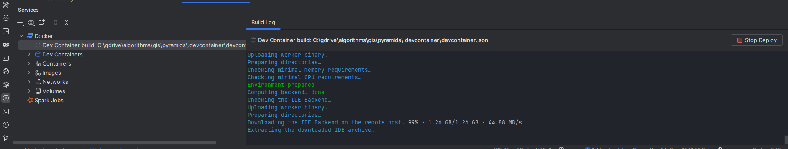
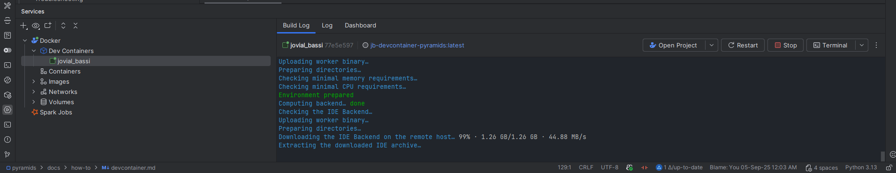

# Using the Dev Container

This guide explains how to develop this project inside a reproducible Dev Container. The Dev Container is configured to 
build from the repository Dockerfile (production stage) and provisions a complete GIS stack (GDAL/PROJ); development tools are available when `ENV_NAME=dev`.

Key facts:
- Image is built from the Dockerfile `production` stage with `ENV_NAME=default` so default (runtime) dependencies are included.
- The Python environment lives at `/opt/venv`. VS Code is configured to use `/opt/venv/bin/python` automatically.
- GDAL/PROJ environment variables are already set inside the container.
- By default, the package is installed non-editably (production-like install). You can optionally enable editable installs 
for live code reloading (see below).
- Dev tools like `pytest` and `pre-commit` are part of the Pixi `dev` environment. To include them by default, change `ENV_NAME` to `dev` in `.devcontainer/devcontainer.json` and rebuild; otherwise you can install them manually inside the container (e.g., `pip install -U pytest pre-commit`).

## Prerequisites

Choose one of the following:
- VS Code on your machine with the “Dev Containers” extension (or "Remote - Containers").
- GitHub Codespaces (works similarly; the config is the same).

You also need Docker running if you build locally.

## Open the repository in the Dev Container

1. Open the folder in VS Code.
2. Run: Command Palette → "Dev Containers: Reopen in Container".
3. The first run will build the image from your Dockerfile and then open the workspace in the container.
4. Post-create step tries to install git hooks (`pre-commit install`) if `pre-commit` is available; otherwise install it (`pip install pre-commit`) or set `ENV_NAME` to `dev` in `.devcontainer/devcontainer.json` and rebuild.

Tip: The first build can take a while because it resolves the Pixi environment and installs GDAL/PROJ.

## Python interpreter

- VS Code is set to use: `/opt/venv/bin/python`.
- You can confirm in VS Code settings or by running `which python` (Linux-style path inside the container):
  ```bash
  which python
  python -V
  ```

## Running tests

- From the integrated terminal in the container:
  ```bash
  pytest -m "not plot" -vvv
  ```
- VS Code Testing UI is already enabled for pytest.
- If pytest is not found (because `ENV_NAME=default` excludes dev tools), either install it (`pip install -U pytest`) or set `ENV_NAME` to `dev` in `.devcontainer/devcontainer.json` and rebuild.

## Working with notebooks

- Jupyter extension is installed. Open a notebook and select the kernel at `/opt/venv/bin/python` if not already selected.

## Pre-commit hooks

- Hooks are installed on first container create: `pre-commit install`.
- You can run them manually:
  ```bash
  pre-commit run --all-files
  ```

## Editable install (optional)

By default the Dockerfile enforces a non-editable install for a production-like environment. This means code edits in `src/` may not immediately reflect in the runtime environment.

If you prefer a live dev workflow inside the container:
1. Open a terminal in the container.
2. Run:
   ```bash
   pip uninstall -y pyramids-gis || true
   pip install -e .
   ```
3. Now changes under `src/` are reflected without rebuilding the image.

Note: If you rebuild the container image, it will revert to the default non-editable install.

## Rebuild and update

- After changing dependencies (pyproject.toml), rebuild the container to capture them:
  - VS Code Command Palette → "Dev Containers: Rebuild Container".
- If caching causes trouble, do a no-cache rebuild via the Dev Containers UI or remove the prior image.

## Environment variables for GDAL/PROJ

The Dockerfile’s `production` stage sets these for you:
- `PATH=/opt/venv/bin:...`
- `LD_LIBRARY_PATH=/opt/venv/lib:...`
- `GDAL_DATA=/opt/venv/share/gdal`
- `PROJ_LIB=/opt/venv/share/proj`
- `PYTHONNOUSERSITE=1`

You normally don’t need to change them.

## Debugging

- Use VS Code’s debugger with the Python extension; it will use `/opt/venv/bin/python`.
- For CLI scripts, add a launch configuration or use the "Run and Debug" panel.

## GitHub Codespaces

- This configuration also works in Codespaces. Open the repo in a Codespace; it will build and use the same container image settings.

## Troubleshooting

- Build is slow or fails on GDAL/PROJ:
  - Ensure Docker has enough RAM/CPU.
  - Try a rebuild without cache.
- Changes in code not reflected:
  - Use the editable install approach above or rebuild the container.
- Disk space issues:
  - Remove old images/containers or increase Docker disk allocation.
- Interpreter mismatch in VS Code:
  - Set Python interpreter to `/opt/venv/bin/python` (Command Palette → Python: Select Interpreter).

## Use the Dev Container in PyCharm

You can use this same Dev Container from PyCharm in two ways.

Prerequisites:
- PyCharm Professional 2023.3+ (recommended 2024.1 or newer)
- Docker Desktop running
- Install the JetBrains plugin: "Dev Containers" (Settings → Plugins → Marketplace → search "Dev Containers" → Install)

Option A — Open the project via the Dev Containers plugin (recommended):
1. File → remote development → dev container → New dev container → select from local Project → then select the 
   devcontainer file .devcontainer/devcontainer.json).
2. Once you select the devcontainer file, the plugin will build the image from the Dockerfile and the `Services` tab 
   will open and display the build progress.

3. Once the build is done you can open the project in the container.

3. The plugin will build from .devcontainer/devcontainer.json (ENV_NAME=default; target is the final production stage) and open the workspace inside the container at `/workspaces/<repo>`.
4. PyCharm will detect the interpreter inside the container. If needed, set it explicitly to `/opt/venv/bin/python`:
   - Settings → Project → Python Interpreter → gear icon → Add… → Dev Container → pick the running devcontainer → Interpreter path: `/opt/venv/bin/python`.
5. Run/Debug configurations:
   - Create a Python configuration using the container interpreter.
   - For tests: Settings → Tools → Python Integrated Tools → Default test runner: pytest.
   - Configure pytest: Settings → Tools → Python Integrated Tools → pytest → Additional arguments: `-m "not plot" -vvv`.
6. Terminals opened in PyCharm will run inside the container (Tools → Terminal). Use `pytest` or any CLI as usual.

Option B — Attach a Docker-based remote interpreter (without the plugin):
1. Build and start the Dev Container once (e.g., via VS Code or `devcontainer up`) so the container exists.
2. In PyCharm: Settings → Project → Python Interpreter → gear icon → Add… → Docker.
3. Select Docker → "Container" and pick the running devcontainer container.
4. Interpreter path: `/opt/venv/bin/python`.
5. Apply. You can now run/debug and test within the container environment.

Notes and tips for PyCharm:
- Workspace path inside container: `/workspaces/${localWorkspaceFolderBasename}` (as per devcontainer.json). PyCharm will map your local project to this path automatically when using the Dev Containers plugin.
- Pre-commit hooks are installed by the container on first create (`pre-commit install`). You can run them in PyCharm’s terminal: `pre-commit run --all-files`.
- Notebooks: PyCharm Pro supports Jupyter. Select the same interpreter `/opt/venv/bin/python` for the notebook kernel.
- Rebuild the container after dependency changes: Tools → Dev Containers → Rebuild (or rebuild via VS Code). This ensures the image picks up changes from pyproject.toml.
- If you see missing GDAL/PROJ or shared library errors, verify the interpreter path is `/opt/venv/bin/python` and that the container you’re attaching to is the devcontainer defined by this repo.

## What’s in the container?

- Editor tooling: Ruff/Pylance extensions are preinstalled for VS Code; in PyCharm, use built-in inspections/formatters or plugins as desired.
- Dev tools: pytest, pre-commit, and Jupyter are available when using `ENV_NAME=dev` or can be installed via `pip` inside the container.
- GIS stack: GDAL, PROJ and related libs, aligned with conda-forge packages solved by Pixi during the image build.

If you want a different balance between dev convenience and production parity (e.g., always editable installs), let us know and we can adjust the devcontainer configuration accordingly.
