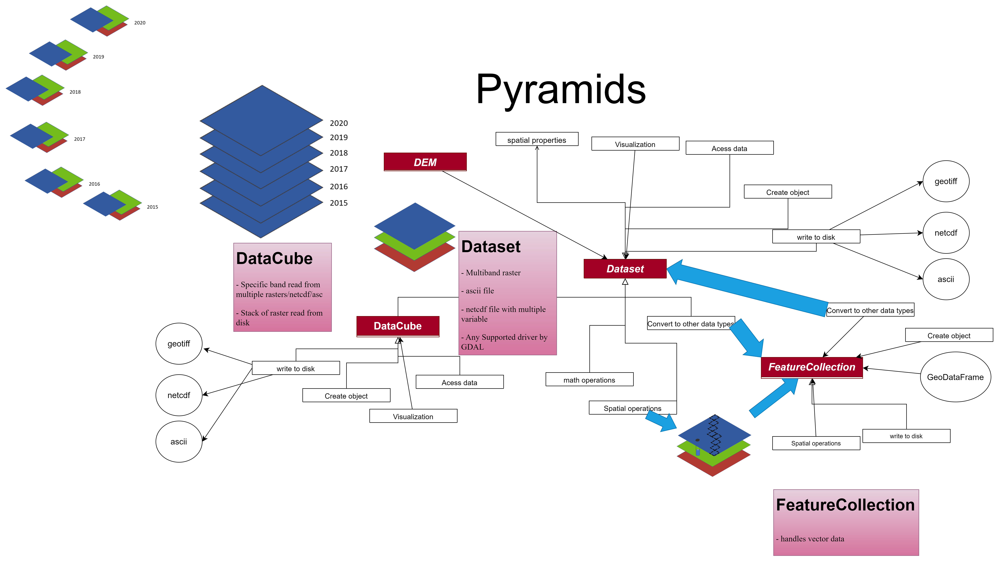

[](https://serapieum-of-alex.github.io/pyramids/main/)
[](https://img.shields.io/pypi/pyversions/pyramids-gis)
[](https://www.gnu.org/licenses/gpl-3.0)
[](https://github.com/pre-commit/pre-commit)


[](https://codecov.io/gh/Serapieum-of-alex/pyramids)
[](https://www.codacy.com/gh/Serapieum-of-alex/pyramids/dashboard?utm_source=github.com&amp;utm_medium=referral&amp;utm_content=Serapieum-of-alex/pyramids&amp;utm_campaign=Badge_Grade)


[](https://github.com/Serapieum-of-alex/pyramids/actions/workflows/pages/pages-build-deployment)

Current release info
====================

| Name                                                                                                                 | Downloads                                                                                                                                                                                                                                                                                                                                                                                                                                                                                                                   | Version                                                                                                                                                                                                                     | Platforms                                                                                                                                                                                                                                                                                                                                 |
|----------------------------------------------------------------------------------------------------------------------|-----------------------------------------------------------------------------------------------------------------------------------------------------------------------------------------------------------------------------------------------------------------------------------------------------------------------------------------------------------------------------------------------------------------------------------------------------------------------------------------------------------------------------|-----------------------------------------------------------------------------------------------------------------------------------------------------------------------------------------------------------------------------|-------------------------------------------------------------------------------------------------------------------------------------------------------------------------------------------------------------------------------------------------------------------------------------------------------------------------------------------|
| [](https://anaconda.org/conda-forge/pyramids) | [](https://anaconda.org/conda-forge/pyramids) [](https://pepy.tech/project/pyramids-gis) [](https://pepy.tech/project/pyramids-gis)  [](https://pepy.tech/project/pyramids-gis)   | [](https://anaconda.org/conda-forge/pyramids) [](https://badge.fury.io/py/pyramids-gis) | [](https://anaconda.org/conda-forge/pyramids) [](https://gitter.im/Hapi-Nile/Hapi?utm_source=badge&utm_medium=badge&utm_campaign=pr-badge&utm_content=badge) |

### conda-forge feedstock
[Conda-forge feedstock](https://github.com/conda-forge/pyramids-feedstock)


pyramids - GIS utility package
=====================================================================
**pyramids** is a GIS utility package using gdal, ....

pyramids



Main Features
-------------

- GIS modules to enable the modeler to fully prepare the meteorological inputs and do all the preprocessing
  needed to build the model (align rasters with the DEM), in addition to various methods to manipulate and
  convert different forms of distributed data (rasters, NetCDF, shapefiles)

## Installation

- Conda (conda-forge):
Installing `pyramids` from the `conda-forge` channel can be achieved by:

```bash
conda install -c conda-forge pyramids
```

It is possible to list all the versions of `pyramids` available on your platform with:

```bash
conda search pyramids --channel conda-forge
```

- pip (PyPI):

to install the last release, you can easily use pip

```bash
pip install pyramids-gis
```

- From source (latest):

to install the last development to time, you can install the library from GitHub

```bash
pip install git+https://github.com/Serapieum-of-alex/pyramids
```

Quick start
===========

## Minimal example: open a dataset and inspect metadata

```python
from pyramids.dataset import Dataset

# Use your own raster path (GeoTIFF/ASC/NetCDF supported); here we show a relative test file
path = "tests/data/geotiff/dem.tif"  # adjust path as needed

ds = Dataset.read_file(path)
print(ds.width, ds.height, ds.transform)
print(ds.meta)

# Access array data
arr = ds.read()
print(arr.shape, arr.dtype)

# Save a single band to a new GeoTIFF (writes alongside input by default)
out = "./dem_copy.tif"
ds.to_file(out)
print("Saved to", out)
```

## Next steps
- Explore the Tutorials for end-to-end workflows.
- See How it works for architecture and data flow.
- Browse the API Reference for details of classes and functions.

