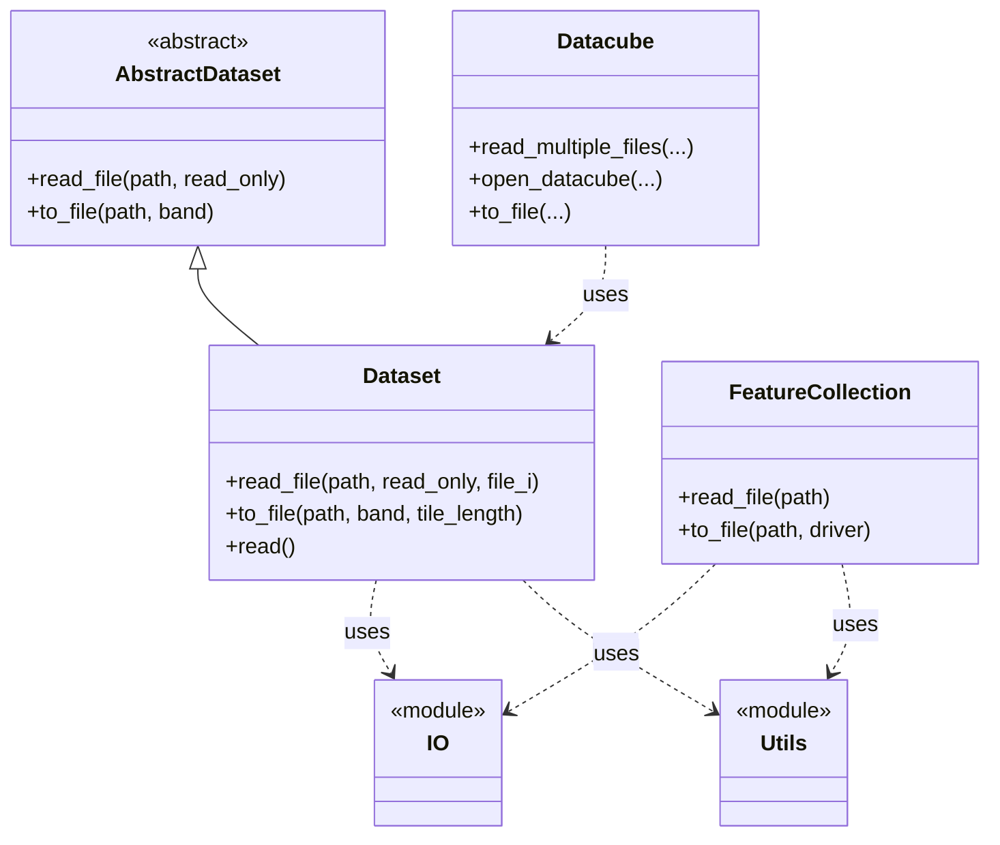

# Codebase Map

This page summarizes the main modules, key classes, and the public API surface of the `pyramids` package.

## Packages and Modules

- pyramids.abstract_dataset
  - Abstract base class that defines the core dataset interface (read, write, metadata, windowing, reprojection scaffolding).
- pyramids.dataset
  - Concrete raster dataset implementation with rich I/O, transformations, tiling, pyramid operations, and export utilities.
- pyramids.datacube
  - Temporal/spatial multi-band or multi-file orchestration (data cube), aggregations, slicing, alignment.
- pyramids.featurecollection
  - Vector data abstraction for feature collections built on GeoPandas; read/write, selection, join, spatial ops.
- pyramids._io
  - Internal helpers for reading/serializing data and archives (zip/gzip/tar parsing, ASCII export), and file path parsing.
- pyramids._utils
  - Utility functions (array ops, geometry helpers, indexing helpers) used across datasets and cubes.
- pyramids._errors
  - Error/exception types used across the package.

## Key Public Classes

- pyramids.dataset.Dataset
- pyramids.datacube.Datacube
- pyramids.featurecollection.FeatureCollection

## Representative Public Methods

- Dataset
  - read_file(path, read_only=True, file_i=0)
  - to_file(path, band=0, tile_length=None)
  - read(...), write(...), crop/align/stack helpers (see API Reference)
- Datacube
  - constructors/helpers to build from folders, patterns, and indexing; slicing and aggregation (see API Reference)
- FeatureCollection
  - read_file(path), to_file(path, driver="geojson"), selection/clip/buffer (see API Reference)

## Data Flow (High Level)

- External data (GeoTIFF/ASC/NetCDF/Vector) -> _io parsers -> Dataset/FeatureCollection objects
- Datasets -> combined via Datacube for temporal/spatial operations
- Outputs -> Dataset/FeatureCollection to_file(), ASCII/GeoTIFF/GeoJSON exports

See the Architecture section for diagrams and deeper internals, and the API Reference for exhaustive signatures.

## Class & Dependency Graph

Below is a high-level Mermaid class dependency diagram showing the main modules and their primary classes, plus key dependencies between them.

Notes:
- Module nodes like `_io` and `_utils` represent internal helper modules used by multiple classes.
- Method lists are illustrative; see the API Reference for complete signatures.
