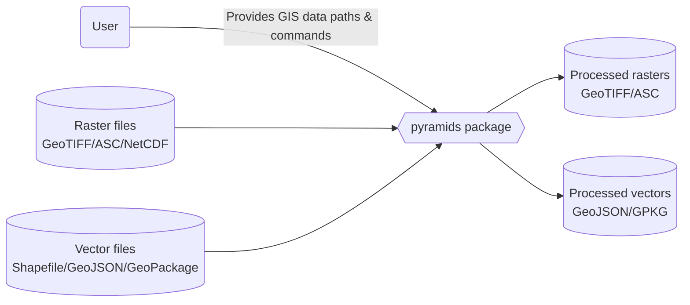
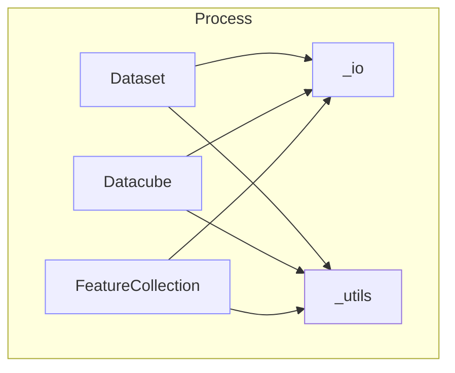

# How it works

This overview explains the system boundaries and data flow of the pyramids package.

## System Context (C4: Context)



## Runtime Containers (C4: Containers)



## Components (C4: Components)

```mermaid
flowchart LR
  io[_io: read_file, to_ascii, path parsing]\nutils[_utils: geometry/index helpers]
  ds[dataset.Dataset]\nabs[abstract_dataset.AbstractDataset]
  dc[datacube.Datacube]\nfc[featurecollection.FeatureCollection]

  abs --> ds
  ds --> io
  dc --> ds
  fc --> io
  ds --> utils
  fc --> utils
```

## Data Flow

1. Input paths are parsed; archives (.zip/.gz/.tar) are handled in `_io`.
2. Raster inputs are loaded into `Dataset`; vector inputs into `FeatureCollection`.
3. `Datacube` orchestrates collections of datasets for temporal/spatial ops.
4. Results are exported via `to_file` (GeoTIFF/ASCII/GeoJSON, etc.).

See the diagrams page for UML and sequence flows.
