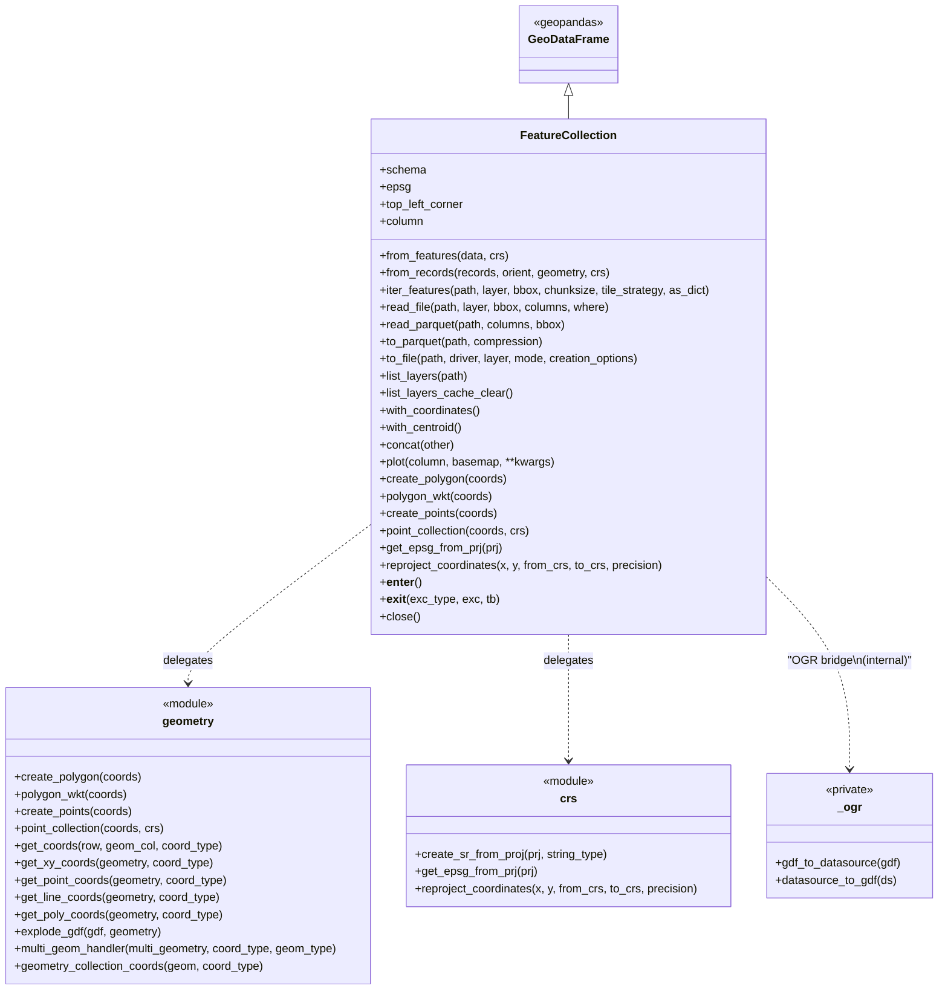

# Feature Subpackage

The `pyramids.feature` subpackage is the vector-data counterpart of
`pyramids.dataset`. It ships a single user-facing class,
[`FeatureCollection`](#featurecollection-class), plus two helper
modules with pure functions for geometry manipulation and CRS handling.

## Module Layout



- [`FeatureCollection`](#featurecollection-class) — the public class, a direct subclass of
  `geopandas.GeoDataFrame`.
- [`geometry`](geometry.md) — shape factories and coordinate-extraction helpers.
- [`crs`](crs.md) — CRS / EPSG / reprojection helpers.
- `_ogr` — private OGR bridge (OGR `DataSource` never leaves the subpackage).

## When to reach for which

| Task | Entry point |
|------|-------------|
| Read a vector file (Shapefile / GeoJSON / GPKG / Parquet / zipped / cloud) | `FeatureCollection.read_file` / `read_parquet` |
| Stream a large file in chunks | `FeatureCollection.iter_features` |
| Build from Python data (records or columnar dict) | `FeatureCollection.from_records` |
| Wrap an existing `GeoDataFrame` | `FeatureCollection(gdf)` or `FeatureCollection.from_features(gdf)` |
| Inspect layers / schema without reading | `FeatureCollection.list_layers`, `.schema` |
| Attach per-vertex or centroid columns | `.with_coordinates()`, `.with_centroid()` |
| Concatenate two FCs safely (CRS-checked) | `.concat(other)` |
| Build raw geometries | `pyramids.feature.geometry.create_polygon` / `create_points` |
| Reproject coordinate arrays | `pyramids.feature.crs.reproject_coordinates` |

## Lazy / Dask reads

For files too large to load eagerly — multi-GB GeoParquet, cloud-hosted
vector tables, planet-scale datasets like Overture Maps — pyramids
offers a dask-backed path:

```python
from pyramids.feature import FeatureCollection

lfc = FeatureCollection.read_parquet(
    "s3://overturemaps-us-west-2/release/2024-07-22.0/theme=places/type=place",
    backend="dask",
    columns=["id", "names", "geometry"],
    bbox=(2.0, 48.8, 2.5, 49.0),
)
lfc.spatial_shuffle().sjoin(zones).compute()
```

The `backend="dask"` branch returns a `LazyFeatureCollection`
(a subclass of `dask_geopandas.GeoDataFrame`) whose partition-aware
ops (`to_crs`, `clip`, `sjoin`, `spatial_shuffle`) run lazily.

See [Lazy vector reads](../../tutorials/lazy/lazy-vector.md) for the full
guide: `spatial_shuffle` → `sjoin` pruning workflow, `compute` vs
`persist`, `to_parquet`, `compute_total_bounds`, and how to wire a
distributed scheduler with `pyramids.configure_lazy_vector`.

Install: `pip install 'pyramids-gis[parquet-lazy]'`.

## FeatureCollection Class

::: pyramids.feature.FeatureCollection
    options:
        show_root_heading: true
        show_source: true
        heading_level: 3
        members_order: source
