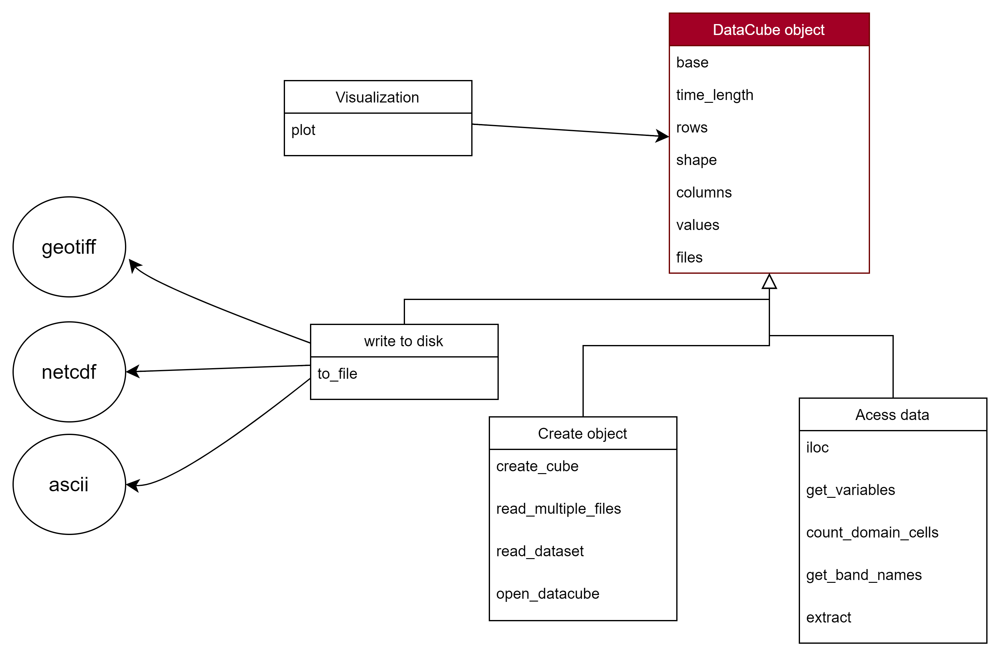
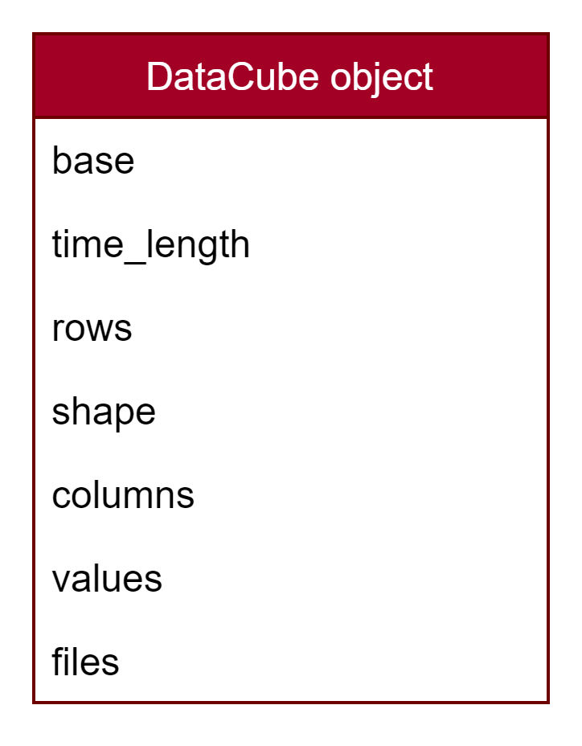

# DataCube

- DataCube class is made to operate on multiple single files.
- DataCube represents a stack of rasters that have the same dimensions (rows & columns).


The datacube object has attributes and methods to help working with multiple raster files, or to repeat the same operation on multiple rasters.

- To import the Datacube class:

```python
from pyramids.multidataset import MultiDataset
```

- The detailed module attributes and methods are summarized in the following figure.



## Attributes

The DataCube object has the following attributes:

1. base: Dataset object
2. columns: number of columns in the dataset
3. rows: number of rows in the dataset
4. time_length: number of files (each file represents a timestamp)
5. shape: (time_length, rows, columns)
6. files: files that have been read



## Methods

### read_multiple_files

- `read_multiple_files` parses files in a directory and constructs a 3D array with the 2D dimensions of the first raster and length equal to the number of files.
- All rasters should have the same dimensions.
- If you want to read the rasters with a certain order, then all raster file names should have a date that follows the same format (YYYY.MM.DD / YYYY-MM-DD or YYYY_MM_DD), e.g. "MSWEP_1979.01.01.tif".

Note:
    — read_multiple_files only parses file names; to open each raster, read a specific band, and add it to the 
        DataCube you have to do one step further using the open_datacube method.

#### Parameters

- path: str | list — path of the folder that contains all the rasters, or a list of raster paths
- with_order: bool — True if the raster names follow a certain order
- regex_string: str — regex string to locate the date in file names; default r"\d{4}.\d{2}.\d{2}"
- date: bool — True if the number in the file name is a date; default True
- file_name_data_fmt: str — date format if files have a date; e.g. "%Y.%m.%d"
- start: str — start date filter
- end: str — end date filter
- fmt: str — format of the given date in the start/end parameter
- extension: str — file extension to read; default ".tif"

#### Case: with_order = False

If you want to make some mathematical operation on all the rasters, the order of the rasters does not matter.

```python
>>> rasters_folder_path = "examples/data/geotiff/raster-folder"
>>> datacube = MultiDataset.read_multiple_files(rasters_folder_path)
>>> print(datacube)
Files: 6
Cell size: 5000.0
EPSG: 4647
Dimension: 125 * 93
Mask: 2147483648.0
```

#### Case: with_order = True

If the order is important (each raster represents a timestamp):
- Each raster must have a date in its file name.

Directory contents example:

```text
MSWEP_1979.01.01.tif
MSWEP_1979.01.02.tif
MSWEP_1979.01.03.tif
MSWEP_1979.01.04.tif
MSWEP_1979.01.05.tif
MSWEP_1979.01.06.tif
```

```python
>>> rasters_folder_path = "examples/data/geotiff/raster-folder"
>>> datacube = MultiDataset.read_multiple_files(
...     rasters_folder_path,
...     regex_string=r"\d{4}.\d{2}.\d{2}",
...     date=True,
...     file_name_data_fmt="%Y.%m.%d",
... )
>>> print(datacube)
     Files: 6
     Cell size: 5000.0
     EPSG: 4647
     Dimension: 125 * 93
     Mask: 2147483648.0
```

If the directory contains files with a number in each file name:

```text
0_MSWEP.tif
1_MSWEP.tif
2_MSWEP.tif
3_MSWEP.tif
4_MSWEP.tif
```

```python
rasters_folder_path = "tests/data/geotiff/rhine"
datacube = MultiDataset.read_multiple_files(
    rasters_folder_path, with_order=True, regex_string=r"\d+", date=False,
)
print(datacube)
# >>>     Files: 3
# >>>     Cell size: 5000.0
# >>>     EPSG: 4647
# >>>     Dimension: 125 * 93
# >>>     Mask: 2147483648.0
```

### open_datacube

After using read_multiple_files to parse the files in the directory, you can read the values of a specific band from each raster using open_datacube.

```python
rasters_folder_path = "examples/data/geotiff/raster-folder"
datacube = MultiDataset.read_multiple_files(rasters_folder_path, file_name_data_fmt="%Y.%m.%d", separator=".")
dataset.open_datacube()
print(dataset.values.shape)
# >>>     (6, 125, 93)
```
